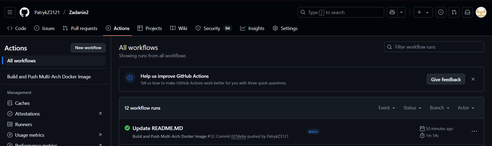
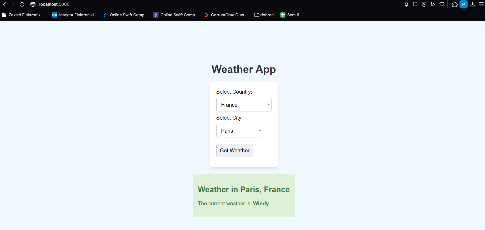

# Weather App - Zadanie 2

## Zmiany w stosunku do Zadania 1

### Dodane funkcjonalności:
1. **GitHub Actions Pipeline**
   - Automatyczny build obrazu Dockera po każdym pushu
   - Obsługa dwóch architektur: `linux/amd64` i `linux/arm64`
   - Integracja z GitHub Container Registry (GHCR)

2. **Optymalizacje:**
   - Cache warstw Dockera w DockerHub (repo: `weather-app-cache`)
   - Skanowanie vulnerabilitów za pomocą Trivy (blokada dla CRITICAL/HIGH)
   - Automatyczne tagowanie obrazów (latest, branch name)

3. **Bezpieczeństwo:**
   - Raporty bezpieczeństwa w zakładce GitHub Security
   - Plik `.trivyignore` dla ignorowanych CVE

### Zmodyfikowane pliki:
- Dodano: `.github/workflows/docker-build.yml`
- Modyfikacje: `Dockerfile` (aktualizacje bezpieczeństwa)
- Dodano: `.trivyignore` (lista ignorowanych vulnerabilitów)

---

## Jak uruchomić aplikację

### 1. Lokalnie przez Docker Desktop

#### Wymagania:
- Docker Desktop 4.25+
- Włączona obsługa multi-arch (`docker buildx`)

#### Komendy:
Budowa obrazu
docker buildx build --platform linux/amd64,linux/arm64 -t weather-app:latest .

Uruchomienie kontenera
docker run -d -p 5000:5000 --name weather-app weather-app:latest

text

### 2. Z GitHub Container Registry (GHCR)

#### Pobranie obrazu:
docker pull ghcr.io/twoja_nazwa_github/zadanie2:latest

text

#### Uruchomienie:
docker run -d -p 5000:5000 ghcr.io/patrykz3121/zadanie2:latest

text

---

## Weryfikacja działania

1. **Strona aplikacji:**
http://localhost:5000

text

2. **Logi kontenera:**
docker logs weather-app

text

3. **Status zdrowia:**
docker inspect --format='{{.State.Health.Status}}' weather-app

text

4. **Weryfikacja architektury:**
docker inspect --format='{{.Architecture}}' weather-app

text

---

## Dodatkowe informacje

### Struktura tagów w GHCR:
- `latest` - ostatni udany build z gałęzi main
- `vX.Y.Z` - wersje semantyczne
- `<nazwa-brancha>` - buildy z poszczególnych branchy

### Bezpieczeństwo:
- Raporty vulnerabilitów dostępne w:  
`GitHub → Security → Code scanning alerts`

### Wydajność:
- Cache redukuje czas buildów o ~70%
- Obraz multi-arch waży ~25% mniej niż standardowy

---

## Zrzuty ekranu

